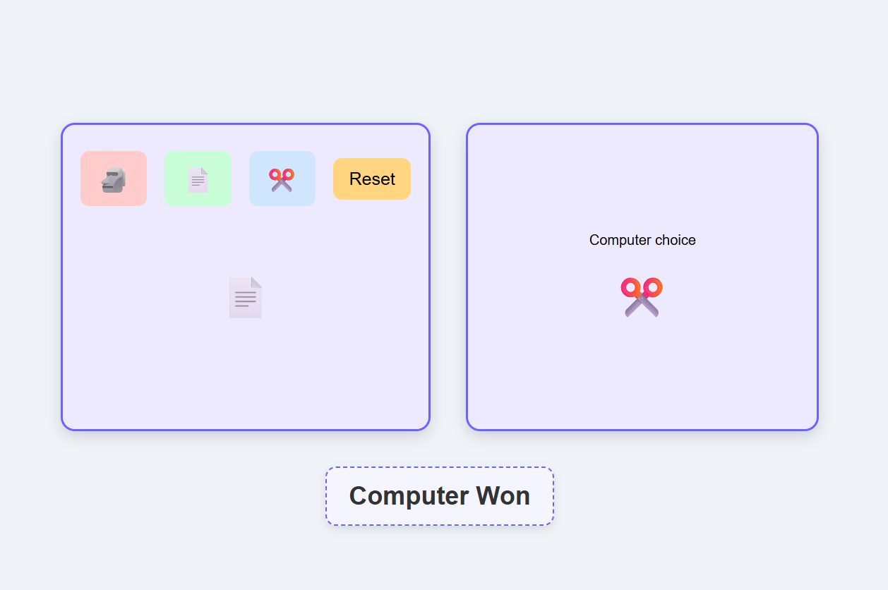

# 🎮 Rock Paper Scissors Game

A simple and interactive **Rock Paper Scissors** game built with **React** and styled with CSS.  
Play against the computer and see who wins!

---

## 🚀 Features
- Choose between 🗿 Rock, 📄 Paper, or ✂️ Scissors
- Computer makes a random choice each round
- Displays result: **Win / Lose / Draw**
- Responsive design (works on desktop & mobile)
- Reset button to start a new round

---

## 🖼️ Demo
 <!-- (Optional: add a screenshot in your repo) -->

---

## 🛠️ Technologies Used
- ⚛️ React  
- 📜 JavaScript (ES6+)  
- 🎨 CSS
- ⚡ Vite  

---

---

